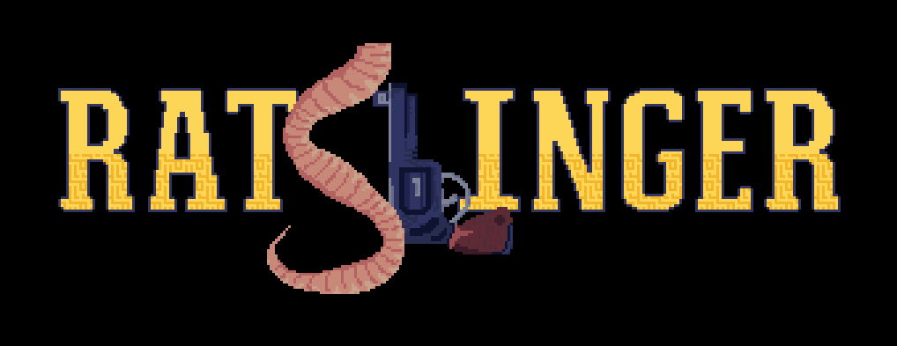
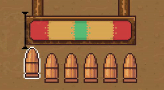
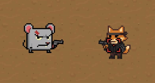
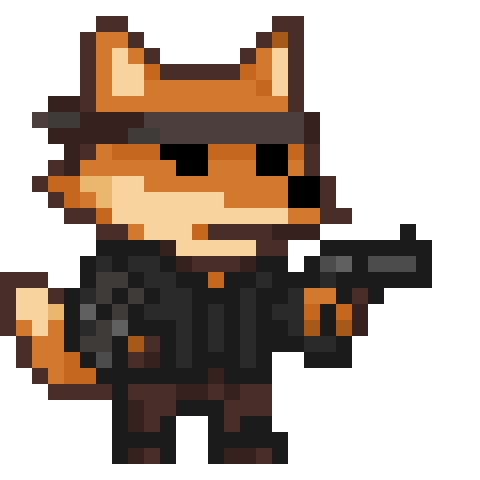
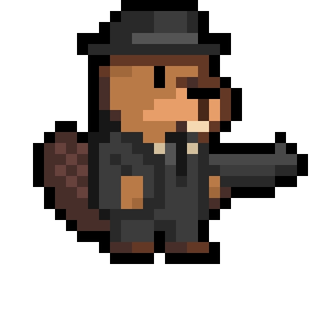
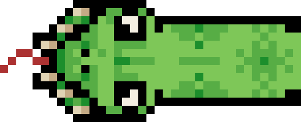
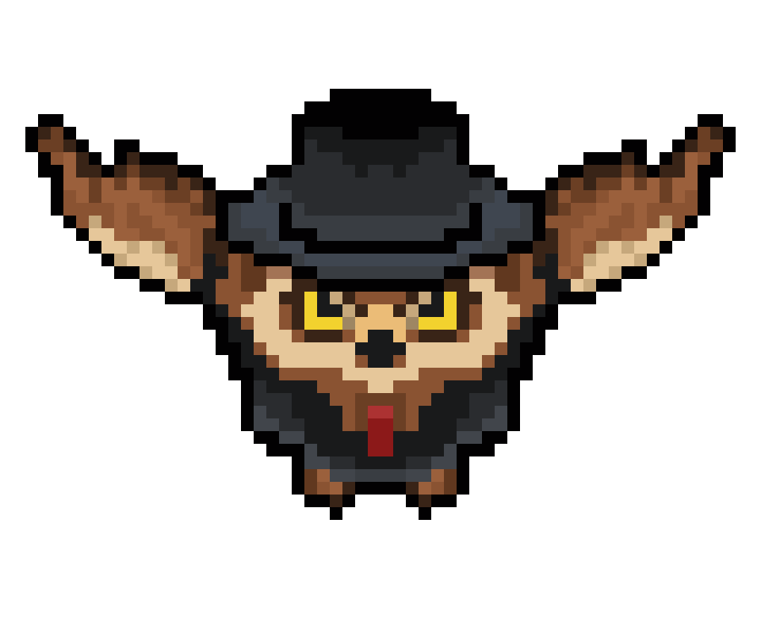
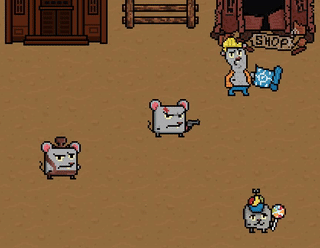

# Ratslinger - a wild west wave defense game

## Overview
Ratslinger is a game where the player becomes a sheriff of a ruined wild-west rat town. The goal is to defend waves of animals that appear after interacting in the middle of the arena. Killed enemies drop coins that are used to buy upgrades that grant special abilities from the shop. The player can also interact with NPCs in the town to obtain side-missions and learn more about lore. The game uses cartoony pixel-art graphics presented from a top-down perspective.

## Features
- Accuracy system: 
 
In the top-right screen corner there is an accuracy bar with red, yellow and green areas. Timing is the key, green enchances shots while red makes you miss.
- Special bullets: 
 
Bought and upgraded in the shop with coins. As of now there are three types: vampiric, inferno and poison. They will appear in your bullet slots, the higher the level, the more often. You have to hit perfect (green area) for the bullet to take effect.
- Enemies: 
 
As of now, the game contains 4 unique enemies: Fox Shooter, Shotgun Beaver, Snake and Owl.
- NPCs: 
 
There are 3 different NPCs:
  - the Mayor - talks about the story and gives you missions,
  - the Builder - repairs the town in-between waves,
  - the Kiddo - a little bystander.

## Support
In [releases](../../releases) you can find a built executable version for 64-bit architecture. Since the project is open-source, you can easily open it in [Godot (4.6+)](https://godotengine.org/download/windows/#platforms) and compile it on your own. This will work for every platform that Godot supports such as Linux and macOS alognside Windows (all of which it was tested for and works).

The game could theoretically make it to mobile but it doesn't support it's controls. We don't plan on officially releasing such version since we believe that would go against game's flow.

## Controls
|action|input|
|------|-----|
|move up|w|
|move down|s|
|move left|a|
|move right|d|
|scale out|q|
|scale in|e|
|toggle accuracy flash and sound (debug)|r|
|toggle title screen skipping (debug)|t|
|interact|z|
|pause/unpause|x|
|shoot|left mouse button|
|progress dialogue|enter, left mouse button, space|
|toggle fullscreen|f11|
|exit|escape|

Custom in-game rebinds are not supported yet.

## Afterword
This game was created as a part of internship in SCI TI highschool.
